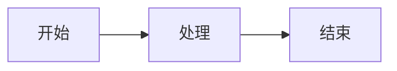

# 快速参考手册

> 基于 doocs/md 最佳实践配置

## 默认配置

```typescript
{
  theme: 'default',              // 经典主题
  fontFamily: '无衬线',           // -apple-system-font...
  fontSize: '14px',              // 更小字号
  codeBlockTheme: 'github-dark-dimmed',
  legend: 'title-alt',           // 图注：title 优先
  isMacCodeBlock: true,          // Mac 代码块：开启
  isShowLineNumber: true,        // 行号：开启
}
```

## 可用主题

| 主题 | 颜色 | 适用场景 |
|------|------|---------|
| default | 经典蓝 `#0F4C81` | 技术文章（默认） |
| roseGold | 玫瑰金 `#92617E` | 时尚、生活 |
| classicBlue | 经典蓝 `#3585e0` | 商务、专业 |
| jadeGreen | 翡翠绿 `#009874` | 自然、健康 |
| vibrantOrange | 活力橘 `#FA5151` | 热情、活力 |

## 代码块配色（github-dark-dimmed）

| 元素 | 颜色 | 示例 |
|------|------|------|
| 背景 | `#22272e` | 深色背景 |
| 文字 | `#adbac7` | 浅灰文字 |
| 注释 | `#768390` 斜体 | `// comment` |
| 关键字 | `#f47067` | `const`, `if` |
| 字符串 | `#96d0ff` | `"hello"` |
| 数字 | `#6cb6ff` | `123` |
| 函数名 | `#dcbdfb` | `myFunc()` |

## 扩展功能

### AI 图片生成（免费）

```bash
# 生成封面
npx tsx ai-image-generator.ts --cover "文章标题"

# 生成配图
npx tsx ai-image-generator.ts "提示词"

# 批量生成
npx tsx ai-image-generator.ts --batch "提示1" "提示2"
```

**服务**：doocs AI 代理（免费，无需 API Key）
**模型**：Kolors

### GFM 警告块

```markdown
> [!NOTE] 提示
> 这是一个提示

> [!TIP] 小技巧
> 这是一个技巧

> [!IMPORTANT] 重要
> 这是一个重要信息

> [!WARNING] 警告
> 这是一个警告

> [!CAUTION] 危险
> 这是一个危险提示
```

### 数学公式

```markdown
行内：$E = mc^2$

块级：
$$
\frac{-b \pm \sqrt{b^2-4ac}}{2a}
$$
```

### Mermaid 图表

```markdown

```

**注意**：微信公众号不支持 JavaScript，Mermaid 会转换为图片占位符提示。

### Ruby 注音

```markdown
[人工智能]{ren-gong-zhi-neng}
[API]^(Application Programming Interface)
```

## 常用命令

```bash
# 完整发布（AI 封面 + 配图）
npx tsx publish-complete.ts articles/my-article.md

# 标准发布（默认封面）
npx tsx publish-article.ts articles/my-article.md

# 生成预览
npx tsx generate-preview.ts articles/my-article.md

# 指定主题
npx tsx publish-complete.ts articles/my-article.md --theme=roseGold

# 使用默认封面（跳过 AI 生成）
npx tsx publish-complete.ts articles/my-article.md --no-cover
```

## 样式速查

### 容器

```css
font-family: -apple-system-font, BlinkMacSystemFont, Helvetica Neue, PingFang SC, ...;
font-size: 14px;
line-height: 1.75;
color: #333;
```

### 标题

| 标题 | 样式 |
|------|------|
| H1 | 居中 + 底部边框（**移除**，避免重复） |
| H2 | 居中 + 主题色背景 + 白色文字 |
| H3 | 左边框 + 主题色边框 |
| H4 | 主题色文字 |

### 代码块

- Mac 风格：红黄绿三色按钮
- 行号：左侧显示，灰色 `#768390`
- 背景：`#22272e`
- 圆角：`5px`

### 图片

- 图注：title 优先
- 居中：`display: block; margin: auto`
- 圆角：`4px`
- AI 生成：优先使用

## 检查清单

发布前必须检查：

- [ ] 标题不重复（移除 H1）
- [ ] 代码块：github-dark-dimmed + Mac + 行号
- [ ] 图片：AI 生成或有效 URL
- [ ] 列表：手动前缀（微信可能不支持 list-style）
- [ ] 所有样式内联

---

**文档**：[SKILL.md](./SKILL.md) | [FORMAT_SPEC.md](./FORMAT_SPEC.md) | [CHECKLIST.md](./CHECKLIST.md)
