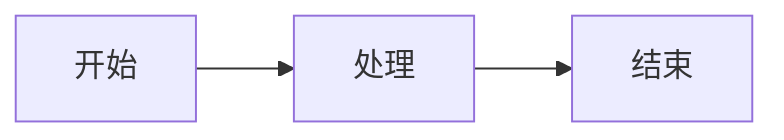

# 微信公众号发布器

自动化生成公众号文章，转换为微信样式，并通过 OpenClaw 消息推送预览。

## ⚠️⚠️⚠️ 格式规范（必须严格遵守）

**微信公众号只支持内联样式（inline style），不支持外部 CSS。**

**每次生成文章前，必须检查以下规范！详见 [FORMAT_SPEC.md](./FORMAT_SPEC.md)**

### 核心原则

1. **标题不重复**：内容中移除 `<h1>` 标题（公众号编辑器已有标题字段）
2. **所有样式必须内联**：每个 HTML 标签都必须有 `style="..."` 属性
3. **代码块必须可读**：github-dark-dimmed 主题 + Mac 风格 + 行号
4. **列表必须手动编号**：微信不支持 `list-style-type`
5. **AI 生成封面**：优先使用 AI 生成（免费），失败则回退到 Unsplash
6. **图文并茂**：自动替换 `IMAGE_PLACEHOLDER` 为 AI 生成图片

## 🆕 扩展功能支持

### 1. AI 图片生成

**优先使用 AI 生成封面和配图**（免费）：
- 服务：doocs AI 代理（`https://proxy-ai.doocs.org/v1`）
- 模型：Kolors（免费）
- 无需 API Key

```bash
# 手动生成图片
npx tsx ai-image-generator.ts "一只可爱的猫咪在编程"

# 生成封面
npx tsx ai-image-generator.ts --cover "OpenClaw 安装教程"
```

### 2. GFM 警告块

在文章中使用警告块强调重要信息：

```markdown
> [!NOTE] 提示
> 这是一个提示信息

> [!TIP] 小技巧
> 这是一个技巧

> [!WARNING] 注意
> 这是一个警告

> [!CAUTION] 危险
> 这是一个危险提示
```

### 3. 数学公式

支持行内和块级数学公式（KaTeX 风格）：

```markdown
行内公式：$E = mc^2$

块级公式：
$$
\frac{-b \pm \sqrt{b^2-4ac}}{2a}
$$
```

### 4. Mermaid 图表

支持 Mermaid 图表语法（会转换为图片占位符提示）：

```markdown

```

### 5. Ruby 注音

支持生僻字注音：

```markdown
[人工智能]{ren-gong-zhi-neng}
[API]^(Application Programming Interface)
```

### ❌ 绝对禁止

```html
<!-- ❌ 错误：标题重复（公众号编辑器已有标题字段） -->
<section>
  <h1>文章标题</h1>
  <p>内容...</p>
</section>

<!-- ❌ 错误：微信不支持 list-style-type -->
<ul style="list-style-type: disc;">
  <li>项目</li>
</ul>

<!-- ❌ 错误：list-style: circle 也不支持 -->
<ul style="list-style: circle;">
  <li>项目</li>
</ul>

<!-- ❌ 错误：微信不支持外部 CSS -->
.hljs-comment { color: #6a737d; }

<!-- ❌ 错误：深色背景 + 无颜色文字 -->
<pre style="background-color: #282c34;">
  <code>代码（看不清）</code>
</pre>
```

## ⚠️ 列表样式说明

**使用 doocs/md 原版样式**：

```html
<!-- ✅ 无序列表 -->
<ul style="list-style: circle; padding-left: 1em; margin-left: 0; color: #333;">
  <li style="display: block; margin: 0.2em 8px; color: #333;">项目 1</li>
  <li style="display: block; margin: 0.2em 8px; color: #333;">项目 2</li>
</ul>

<!-- ✅ 有序列表 -->
<ol style="padding-left: 1em; margin-left: 0; color: #333;">
  <li style="display: block; margin: 0.2em 8px; color: #333;">第一项</li>
  <li style="display: block; margin: 0.2em 8px; color: #333;">第二项</li>
</ol>
```

### 关键要点

1. **`list-style: circle`** - 无序列表使用圆点
2. **`padding-left: 1em`** - 左边距缩进
3. **`display: block`** - li 设置为块级元素
4. **有序列表** - 使用默认的数字序号

### ✅ 正确做法

```html
<!-- ✅ 标题：只在公众号编辑器填写，内容中不包含 -->
<!-- 内容直接从 <h2> 或 <p> 开始 -->
<section>
  <h2 style="...">第一节</h2>
  <p style="...">内容...</p>
</section>

<!-- ✅ 代码块：github-dark-dimmed 主题 + Mac 风格 + 行号 -->
<section style="margin: 10px 8px; border-radius: 5px; overflow: hidden; background: #22272e;">
  <div style="height: 30px; background: #1e2128; display: flex; align-items: center; padding-left: 12px;">
    <span style="width: 12px; height: 12px; border-radius: 50%; background: #ff5f56;"></span>
    <span style="width: 12px; height: 12px; border-radius: 50%; background: #ffbd2e; margin-left: 8px;"></span>
    <span style="width: 12px; height: 12px; border-radius: 50%; background: #27c93f; margin-left: 8px;"></span>
  </div>
  <pre style="margin: 0; padding: 16px; overflow-x: auto; background: #22272e;">
    <code style="color: #adbac7; font-size: 12.6px;">
      <div style="display: flex;">
        <span style="min-width: 40px; text-align: right; color: #768390; border-right: 1px solid #373e47; margin-right: 10px; padding-right: 10px;">1</span>
        <span><span style="color: #f47067;">const</span> app = <span style="color: #dcbdfb;">express</span>();</span>
      </div>
    </code>
  </pre>
</section>

<!-- ✅ 无序列表：手动添加圆点 -->
<ul style="list-style-type: none;">
  <li><span style="margin-right: 8px;">•</span>列表项 1</li>
  <li><span style="margin-right: 8px;">•</span>列表项 2</li>
</ul>

<!-- ✅ 有序列表：手动添加序号 -->
<ol style="list-style-type: none;">
  <li><span style="margin-right: 8px; font-weight: bold;">1.</span>第一项</li>
  <li><span style="margin-right: 8px; font-weight: bold;">2.</span>第二项</li>
</ol>

<!-- ✅ 图片：AI 生成或 Unsplash -->

```

### 格式检查清单

生成文章后，**必须验证**：详见 [CHECKLIST.md](./CHECKLIST.md)

- [ ] **标题**只出现在公众号编辑器，**不在**内容中（避免重复）
- [ ] **代码块背景**是 `#22272e`（github-dark-dimmed），**不是**浅色
- [ ] **代码文字**是 `#adbac7`，**高对比度**
- [ ] **代码块有 Mac 三色按钮**（红黄绿）
- [ ] **代码块有行号**
- [ ] **每个语法高亮**的 `<span>` 都有 `style` 属性
- [ ] **列表项**有手动添加的前缀（`•` 或 `1.` `2.`）
- [ ] **没有** `list-style-type: disc/decimal`（会被微信忽略）
- [ ] **没有**外部 CSS class（如 `.hljs-comment`，必须有内联 style）
- [ ] **封面图片**已上传到微信素材库（如果启用了 `fetchCover`）
- [ ] **配图占位符**已替换为真实图片（如果启用了 `fetchImages`）

### 使用的格式化器

**必须使用**：`wechat-formatter-fixed.ts`（修复版）

**禁止使用**：
- `wechat-formatter.ts`（旧版，有列表问题）
- `wechat-formatter-v2.ts`（旧版，有代码块问题）
- `wechat-formatter-v3.ts`（旧版，有代码块问题）

### 默认配置（来自 doocs/md 最佳实践）

```typescript
const defaultStyleConfig = {
  theme: 'default',              // 经典主题
  fontFamily: '-apple-system-font,BlinkMacSystemFont,Helvetica Neue,PingFang SC,Hiragino Sans GB,Microsoft YaHei UI,Microsoft YaHei,Arial,sans-serif',  // 无衬线
  fontSize: '14px',              // 更小字号
  codeBlockTheme: 'github-dark-dimmed',  // 代码块主题
  legend: 'title-alt',           // 图注格式：title 优先
  isMacCodeBlock: true,          // Mac 代码块：开启
  isShowLineNumber: true,        // 代码块行号：开启
}
```

**代码块**（github-dark-dimmed 主题）：
- 背景：`#22272e`
- 文字：`#adbac7`
- 注释：`#768390` 斜体
- 关键字：`#f47067` 加粗
- 字符串：`#96d0ff`
- 数字：`#6cb6ff`
- 函数：`#dcbdfb`
- **Mac 三色按钮**：开启（红黄绿）
- **行号**：开启（灰色 `#768390`）

**行内代码**：
- 背景：`rgba(27, 31, 35, 0.05)`
- 文字：`#d14`

**字体**：
- 字号：`14px`（更小）
- 行高：`1.75`
- 字体：无衬线（-apple-system-font 等）

**列表**：
- 无序：`circle` 样式（或手动 `•` 前缀）
- 有序：自动编号

---

## 快速开始

### 1. 配置 MinIO

编辑配置文件或设置环境变量：

```bash
export WECHAT_PUBLISHER_CONFIG="/path/to/config.json"
```

配置示例：
```json
{
  "minio": {
    "endpoint": "minio.example.com",
    "port": 9000,
    "useSSL": true,
    "accessKey": "YOUR_KEY",
    "secretKey": "YOUR_SECRET",
    "bucket": "wechat-images",
    "publicUrl": "https://cdn.example.com"
  },
  "generator": {
    "topics": ["技术分享", "行业观察", "产品思考"],
    "defaultTopic": "技术分享",
    "style": "专业但不枯燥",
    "length": 1500
  },
  "schedule": {
    "times": ["08:00", "12:00", "18:00"],
    "timezone": "Asia/Shanghai"
  }
}
```

### 2. 使用方式

**手动生成文章：**
```
帮我生成一篇关于"AI发展趋势"的公众号文章
```

**从现有内容转换：**
```
把这段内容转成微信格式：
[你的 Markdown 内容]
```

**设置定时任务：**
```
每天早上8点、中午12点、晚上6点各生成一篇文章
```

## 工作流程

```
用户请求 / 定时触发
       ↓
   AI 生成文章
       ↓
 Markdown → 微信样式 HTML
       ↓
   图片上传 MinIO
       ↓
   保存预览文件
       ↓
   推送预览链接给用户
       ↓
   用户确认 → 复制到公众号后台
```

## 可用主题

- `default` - 经典（默认，蓝色主题色 `#0F4C81`）
- `roseGold` - 熏衣紫（主题色 `#8B7BA8`）
- `classicBlue` - 经典蓝（主题色 `#3585e0`）
- `jadeGreen` - 翡翠绿（主题色 `#009874`）
- `vibrantOrange` - 活力橘（主题色 `#FA5151`）

指定主题：`用 roseGold 主题生成一篇关于...`

## 代码块特性

**Mac 风格代码块**（默认开启）：
- 顶部显示红黄绿三色按钮
- 圆角设计
- 更加美观专业

**代码行号**（默认开启）：
- 左侧显示行号
- 灰色文字（`#768390`）
- 右侧边框分隔

**github-dark-dimmed 主题**：
- 深色背景（`#22272e`）高对比度
- 清晰的语法高亮
- GitHub 风格配色

## 定时任务配置

在 HEARTBEAT.md 或通过 cron 设置：

```bash
# 每天 8:00 生成文章
0 8 * * * openclaw run "生成一篇技术文章"

# 每天 12:00 生成文章
0 12 * * * openclaw run "生成一篇产品思考"

# 每天 18:00 生成文章
0 18 * * * openclaw run "生成一篇行业观察"
```

## 输出文件

生成的文章保存在 `./articles/` 目录：

- `2024-01-15_08-00-00_abc123.md` - Markdown 原文
- `2024-01-15_08-00-00_abc123.html` - 渲染后 HTML（可复制）
- `2024-01-15_08-00-00_abc123_preview.html` - 预览页面

## 注意事项

1. **订阅号限制**：由于是个人订阅号，无法通过 API 直接发布，需要手动复制到公众号后台
2. **图片要求**：MinIO 需要公网可访问，否则微信无法加载图片
3. **文章确认**：每篇文章生成后会推送预览，确认后再发布

## 脚本说明

| 脚本 | 功能 | 状态 |
|-----|------|------|
| `publish-complete.ts` | **完整发布脚本**（推荐） | ✅ 移除标题 + 自动封面 + 配图 |
| `publish-article.ts` | 标准发布脚本 | ✅ 移除标题 + 使用默认封面 |
| `wechat-formatter-fixed.ts` | **修复版格式化器** | ✅ 符合微信规范 |
| `image-fetcher.ts` | 图片获取工具 | ✅ Unsplash 图库 |
| `wechat-api.ts` | 微信 API 封装 | ✅ 草稿/素材管理 |
| `ai-generator-v2.ts` | AI 文章生成器 | ✅ 精炼版 |
| `config.ts` | 配置管理 | ✅ 正常 |
| `upload-images.ts` | MinIO 图片上传 | ✅ 正常 |
| `workflow.ts` | 完整工作流 | ✅ 正常 |
| `scheduler.ts` | 定时任务 | ✅ 正常 |
| `cli.ts` | CLI 工具 | ✅ 正常 |
| `index.ts` | 主入口 | ✅ 正常 |

**⚠️ 重要**：所有发布操作都应该使用 `publish-complete.ts`（完整版）或 `publish-article.ts`（标准版）。

## 示例对话

**用户**：帮我生成一篇关于"大模型应用"的技术文章

**AI**：
1. 调用 `workflow.ts` 生成文章
2. 保存预览文件
3. 返回预览链接

```
✅ 文章已生成！

📝 标题：大模型应用：从概念到落地的实践之路

📄 预览链接：./articles/2024-02-28_08-00-00_abc123_preview.html

📋 复制内容：./articles/2024-02-28_08-00-00_abc123.html

确认发布吗？我可以帮你打开预览页面。
```
